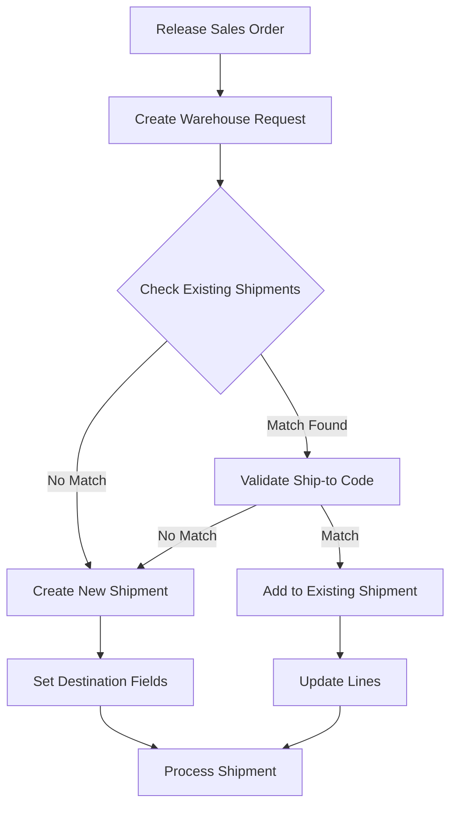
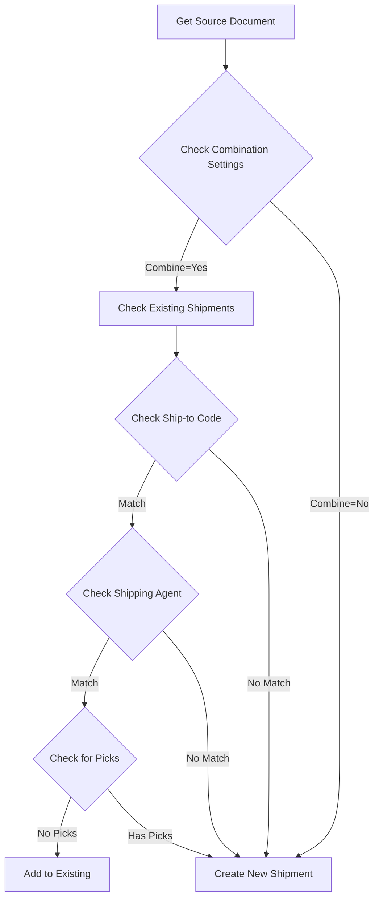

# Enhanced Warehouse Shipment Combination

## Overview
A modern Business Central extension that intelligently combines warehouse shipments based on Ship-to Codes. Built on Olof Simren's original concept, enhanced with modern event architecture and improved reliability.

## Features
- Event-driven architecture
- Intelligent shipment combination
- Robust error handling
- No base modifications

## Process Flow

## Installation
1. Import AL files
2. Publish extension
3. No additional setup needed

## Usage
1. Release sales orders
2. Run "Create Warehouse Shipment" batch job
3. System automatically combines matching shipments

## Combination Logic

## Requirements
- Business Central 2024 Wave 1 (BC23)
- Standard warehouse setup

## Technical Details
- Event-based architecture
- Clean record handling
- Robust error prevention
- Transaction management

## Contributing
Issues and enhancements welcome via issue tracker

## Version History
- 2.0.0: Modern event architecture
- 1.0.0: Initial implementation

## License
[Your License]

## Credits
- Original concept: Olof Simren
- Modern implementation: Paul Rennison
