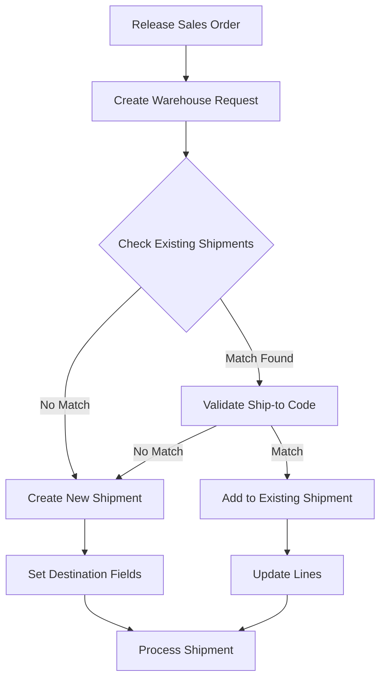
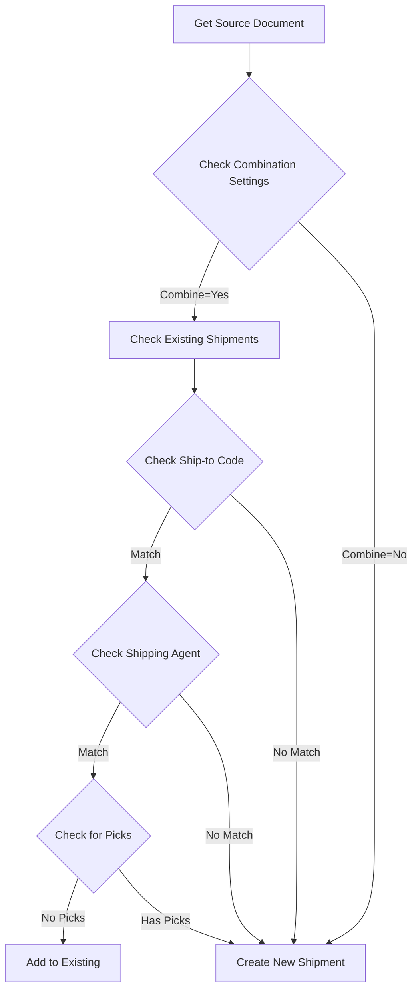
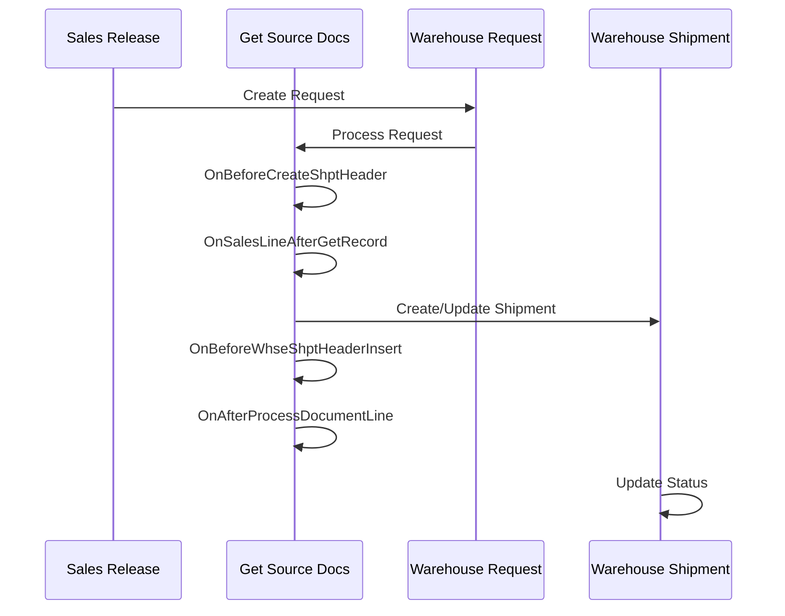

# Enhanced Warehouse Shipment Combination - Technical Documentation

## Core Architecture

### Event Subscribers Overview
The solution is built on BC's event architecture using these key events:

```al
// Main shipment combination events
OnSalesLineOnAfterGetRecordOnBeforeCreateShptHeader 
- Primary event for shipment combination logic
- Handles existing shipment detection
- Controls shipment header creation

OnBeforeCreateShptHeader
- Handles new shipment creation
- Sets initial field values
- Controls header initialization

OnBeforeWhseShptHeaderInsert
- Final validation before insert
- Sets destination fields
- Ensures data consistency

OnAfterProcessDocumentLine
- Controls line addition
- Validates combinations
- Handles line processing
```

### Combination Logic
The system uses the following hierarchy for combination decisions:

```al
// Combination validation sequence
1. Location Code
2. Destination Type
3. Destination No. (Customer)
4. Destination Sub. No. (Ship-to Code)
5. Shipping Agent Code
```

## Process Flows



### Combination Logic Flow



### Event Processing Sequence



## Technical Implementation Details

### Record Handling
```al
// Example of proper record handling
ExistingShipment.Reset();
ExistingShipment.SetRange("Location Code", WarehouseRequest."Location Code");
ExistingShipment.SetRange("Destination Type", WarehouseRequest."Destination Type");
ExistingShipment.SetRange("Destination No.", WarehouseRequest."Destination No.");
ExistingShipment.SetRange("Destination Sub. No.", WarehouseRequest."Destination Sub. No.");
```

### Error Prevention
```al
// Validation example
if WarehouseShipmentHeader."No." = '' then begin
    // New shipment handling
    WarehouseShipmentHeader.Validate("Destination Type", WarehouseRequest."Destination Type");
    WarehouseShipmentHeader.Validate("Destination No.", WarehouseRequest."Destination No.");
end else begin
    // Existing shipment validation
    if WarehouseShipmentHeader."Destination Sub. No." <> WarehouseRequest."Destination Sub. No." then
        Error(ShipToCodeMismatchErr);
end;
```

## Error Handling

### Common Scenarios
1. Ship-to Code Mismatch
2. Existing Pick Validation
3. Record Lock Handling
4. Transaction Management

### Validation Rules
- Ship-to Code must match exactly
- No existing picks for combination
- Valid shipping agent codes
- Open warehouse shipment status

## Best Practices

### Performance Optimization
1. Proper record filtering
2. Efficient transaction handling
3. Minimal record locks
4. Smart batching of operations

### Code Organization
1. Clear event separation
2. Proper error handling
3. Consistent validation patterns
4. Clean transaction boundaries

## Testing Guide

### Test Scenarios
1. Single order, new shipment
2. Multiple orders, same ship-to
3. Multiple orders, different ship-to
4. Existing shipment combination
5. Pick validation scenarios

### Validation Tests
1. Ship-to code matching
2. Shipping agent validation
3. Pick existence checks
4. Record lock handling